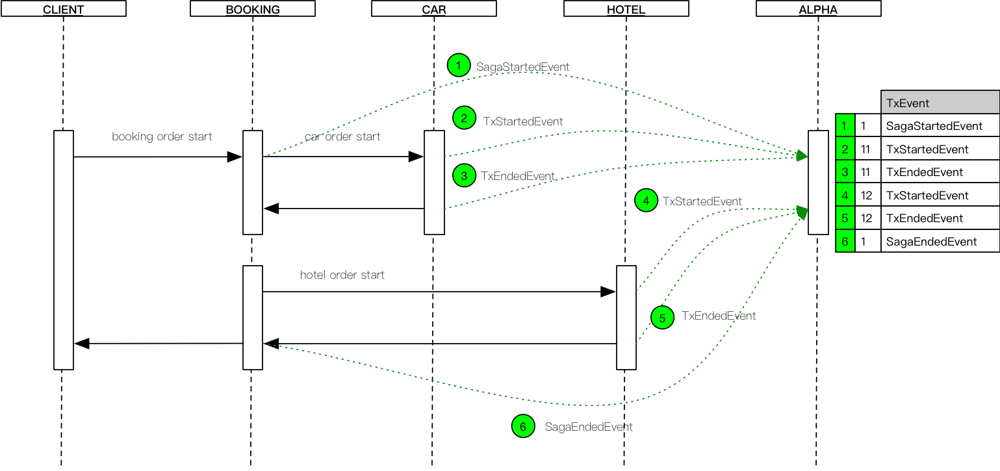
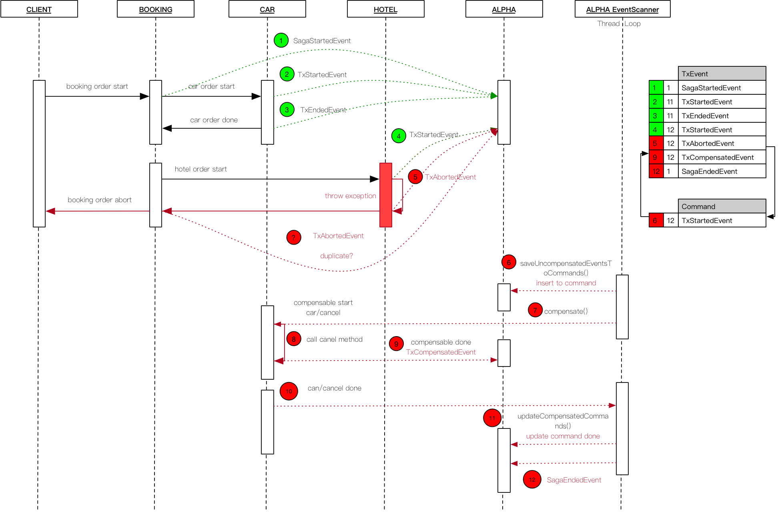
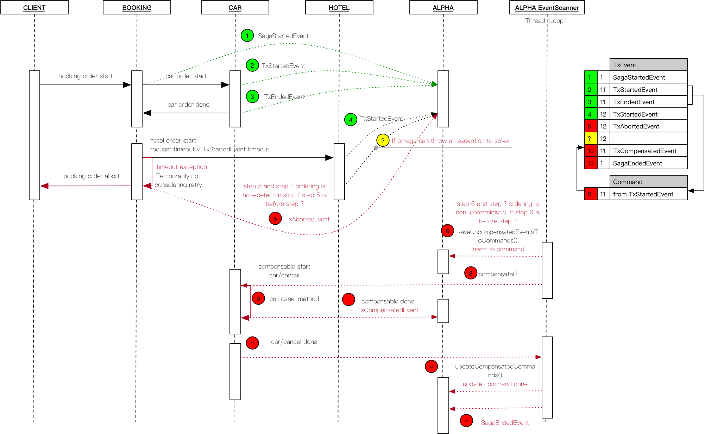
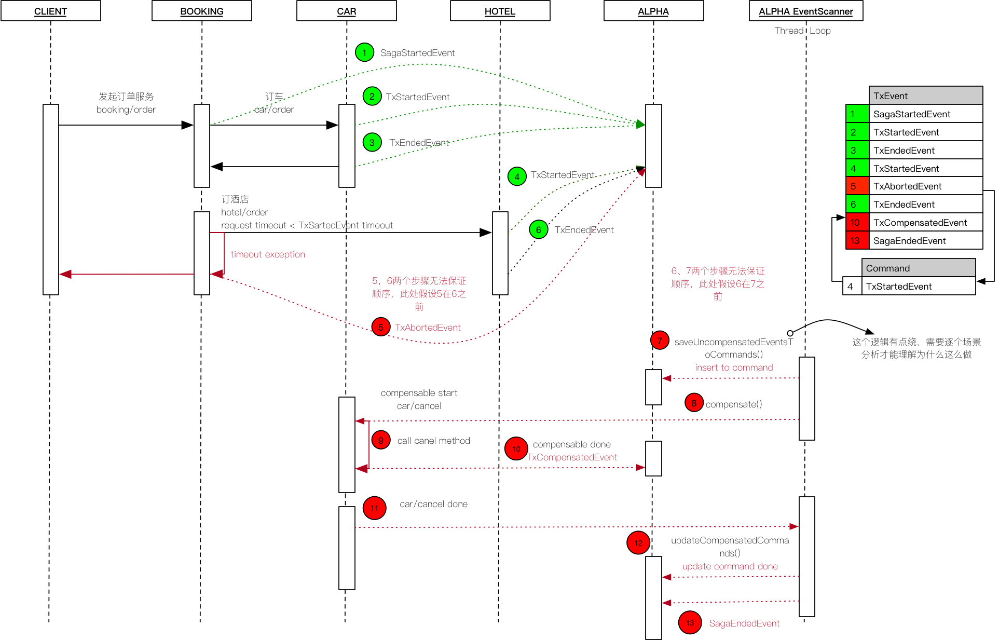
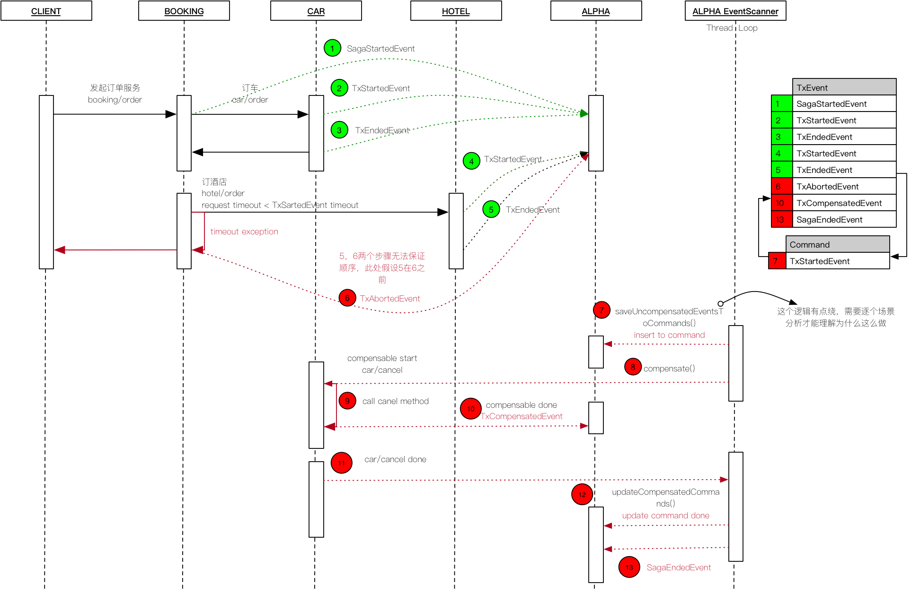
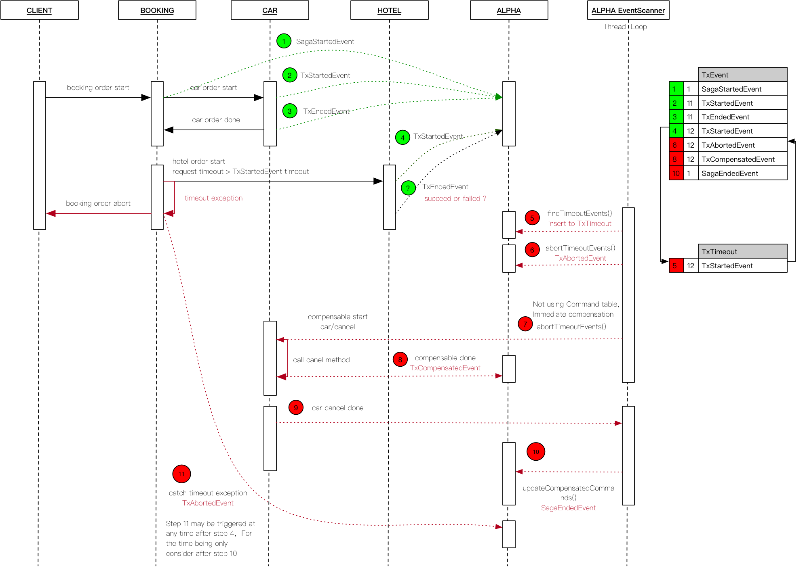
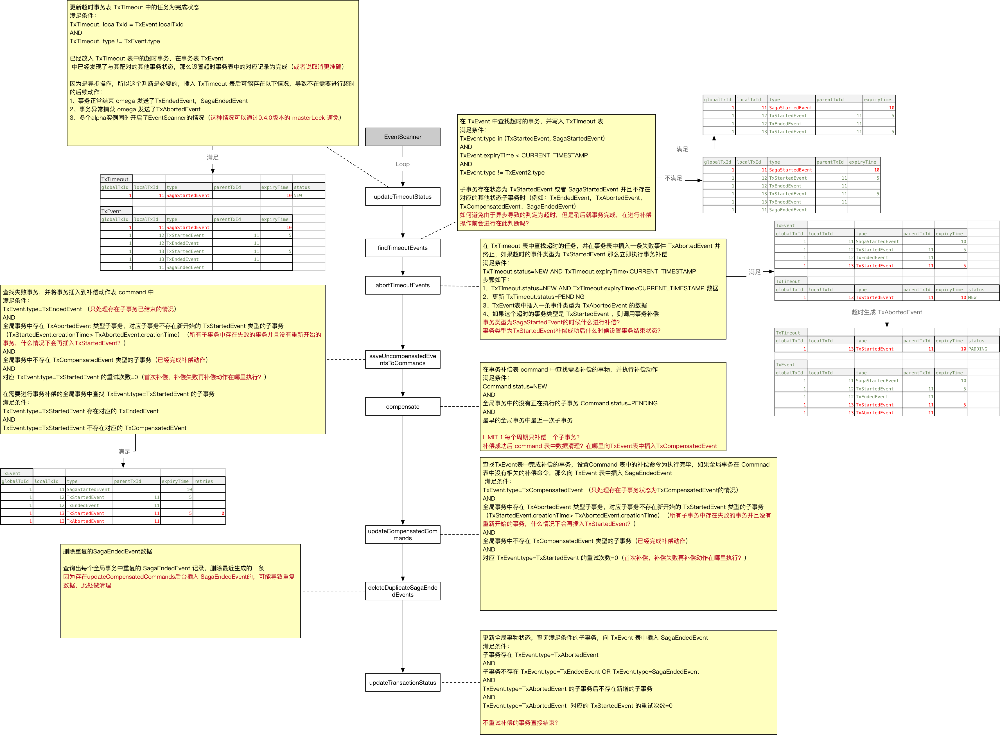

# Alpha Saga 事务流转笔记

> 以下描述如有错误，请以 0.4.0 源代码为准 😅 😅 

1. 正常的流转

2. 服务异常

   HOTEL 服务内部异常，触发事务补偿

3. 请求超时
   
   由于设置 request timeout 小于 Saga事务的 timeout 导致的请求超，步骤 7 晚于后台超时检查动作时
   

4. 请求超时

   由于设置 request timeout 小于 Saga事务的 timeout 导致的请求超，步骤 6 早于后台超时检查动作时

5. 请求超时

   由于设置 request timeout 小于 Saga事务的 timeout 导致的请求超，步骤 6 晚于步骤 5 发生时

6. 事务超时

   Saga事务的 timeout 导致的超时

7. 关于 EventScanner 粗略阅读了一遍，疑问暂时红色字体标出，后续再细读更新（以下描述如与上面的描述不同，则以上图为准）

