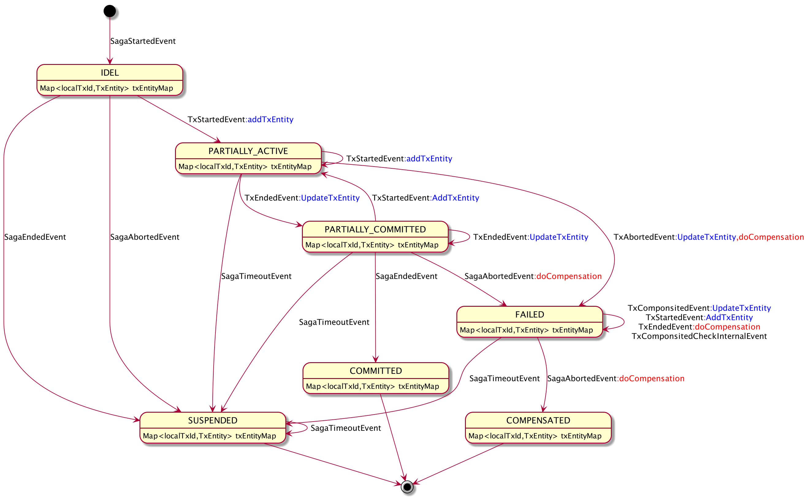

# ServiceComb Pack Saga Pattern With Akka

## SAGA 模式

Saga模式将整个交易分解为多个子事务，只有子事务可以在原子事务中执行，但整体的一致性由Saga处理。 Saga负责完成整个业务交易或使系统处于已知的终止状态。如果出现错误，则整个交易回滚，该过程通过以相反顺序调用补偿步骤来实现， 更多的关于Saga的原理可以参考以下两篇介绍。

[基于服务的分布式事务(上篇)](https://servicecomb.apache.org/cn/docs/distributed-transaction-of-services-1)

[基于服务的分布式事务(上篇)](https://servicecomb.apache.org/cn/docs/distributed-transaction-of-services-2)

ServiceComb Pack Omega 组件通过拦截应用系统的业务请求，将事件发送给 Alpha，Alpha 作为协调者负责接收事件并根据输入事件和当前状态输出一个新状态。在 0.5.0 版本以前我们通过将输入事件写入事件表，并根据定期表扫描判断下一状态，从而决定交易终止状态。目前看来这工作的很好，但是存在以下问题

* 事件同步写入事件表的效率问题
* 基于表扫描的性能问题
* 随着未来引入异步、并发等复杂子事务时导致的事件倒置等复杂逻辑问题

在 0.5.0 版本我们尝试使用状态机来解决这些问题，当然首先我们要能够抽象出 Saga 的状态机。

## 有限状态机

> （缩写：**FSM**）又称**有限状态自动机**，简称**状态机**，是表示有限个状态以及在这些状态之间的转移和动作等行为的数学模型

我们可以将 Saga 状态机抽象成事件和状态的组合关系

* 事件定义

  | 名称               | 缩写           | 描述           |
  | ------------------ | -------------- | -------------- |
  | SagaStartedEvent   | Ess | 全局事务开始   |
  | SagaEndedEvent     | Ese | 全局事务结束   |
  | SagaAbortedEvent   | Esa | 全局事务失败   |
  | TxStartedEvent     | Ets | 子事务开始     |
  | TxEndedEvent       | Ete | 子事务结束     |
  | TxAbortedEvent     | Eta | 子事务失败     |
  | TxComponsitedEvent | Etc | 子事务补偿成功 |

* 状态定义

  | 名称                | 描述                                                         |
  | ------------------- | ------------------------------------------------------------ |
  | IDLE                | 空闲状态：Actor 创建后的初始化状态                           |
  | READY               | 就绪状态：收到全局务开始事件  `SagaStartedEvent` 后的状态    |
  | PARTIALLY_ACTIVE    | 部分开始状态：收到了子事务开始事件  `TxStartedEvent` 后的状态 |
  | PARTIALLY_COMMITTED | 部分提交状态：收到了事务结束事件 `TxEndedEvent` 后的状态     |
  | FAILED              | 失败状态：全局事务失败状态，当收到 `TxAbortedEvent` 或者 `SagaAbortedEvent` 事件满足进入此状态后将对所有已提交的子事务进行补偿，并在此状态等待所有 `TxComponsitedEvent` 收到后转换为 `COMPENSATED` 状态并终止。考虑到并行子事务的可能性，在此状态下收到 `TxEndedEvent` 事件后也将调用补偿方法 |
  | COMMITTED           | 已提交状态：全局事务正常结束状态，所有子事物都已经提交       |
  | COMPENSATED         | 已补偿状态：全局事务正常结束状态，所有已经提交的子事务补偿成功 |
  | SUSPENDED           | 挂起状态：全局事务异常结束状态，当出现不符合预期的事件状态组合或者收超时将进入挂起状态，设计挂起状态的目的是为了避免问题扩散，此时需要人工介入处理 |

* 状态转换表

  

* 状态图

  

* 设计约定

  由于状态机的设计必须遵许已知的事件类型和顺序，而事件的发送又依赖于开发者对于 Omega 组件的使用，为了避免未知的情况出现而导致的不可控情况，本设计遵循以下约定

  1. 状态机只处理已知的有序事件组合情况
  2. 对于未知的事件组合情况统一将状态设置成 SUSPENDED 并结束
  3. 超时发生时将状态设置成 SUSPENDED 并结束
  4. 状态机内部会记录完整的事件记录以及状态转换记录，以便于问题的分析以及手动补偿

## Akka

介绍技术选型 Akka FSM 优势 

整合 Akka 后的架构图

## 压力测试报告

报告说明

